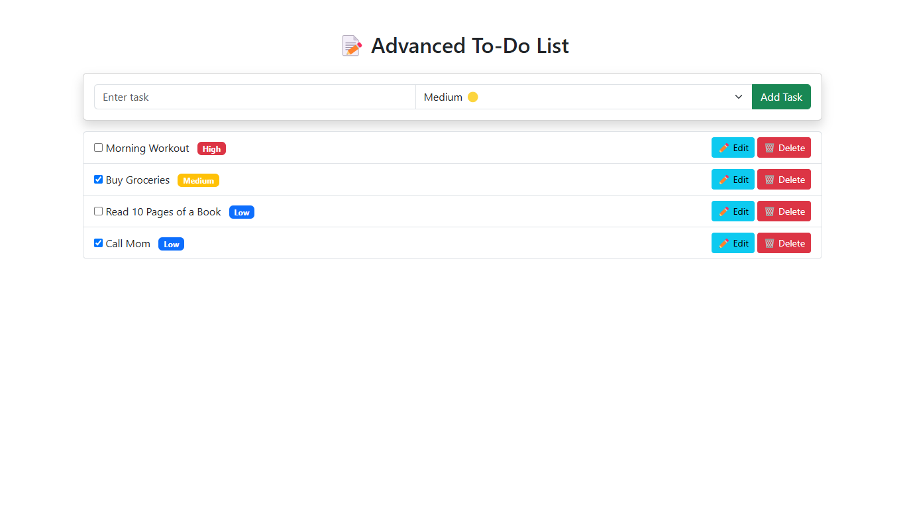

# ✅ Angular To-Do List App

This is a **simple yet powerful To-Do List application** built with **Angular and Bootstrap 5**. It allows users to **add, delete, and mark tasks as completed** with a clean UI.



## 🚀 Features
✅ Add New Tasks  
✅ Mark Tasks as Completed  
✅ Delete Tasks  
✅ Local Storage Support (Tasks persist even after page refresh)  
✅ Responsive & Mobile Friendly  

## 🛠 Technologies Used
- **Frontend:** Angular, Bootstrap 5 (CDN)
- **Icons:** Bootstrap Icons (CDN)
- **Styling:** CSS3, Google Fonts (Poppins)
- **Storage:** Local Storage API for persisting tasks

## 🔧 Installation & Setup
1. Clone this repository:
   ```sh
   git clone https://github.com/Daiva-krupa/Angular_Projects.git
   cd Angular_Projects
