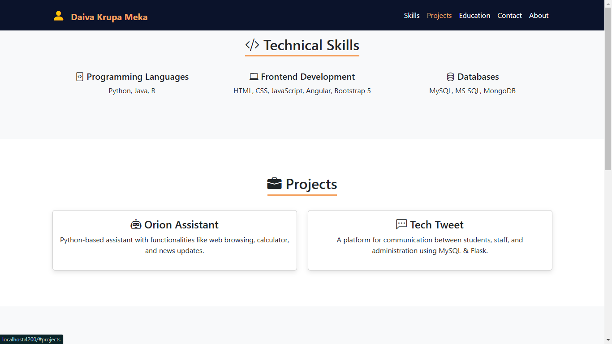
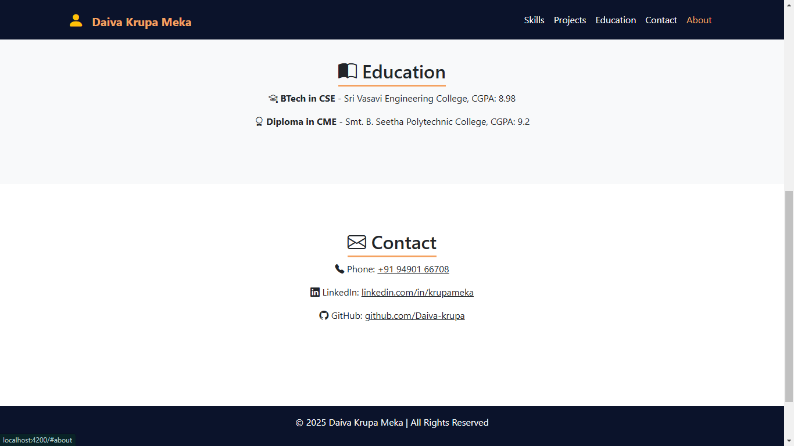

# 🌟 Krupa Portfolio - Daiva Krupa Meka

This is a **modern, responsive, and stylish portfolio** built using **Angular and Bootstrap 5**. It showcases **skills, projects, education, and contact details** with a professional design.




## 🚀 Features
✅ Fully Responsive & Mobile-Friendly  
✅ Modern Bootstrap 5 Theme  
✅ Smooth Scroll Navigation  
✅ Dynamic Sections (About, Skills, Projects, Contact)  
✅ Icons & Images for a Professional Look  
✅ No External Installations Needed  

## 🛠 Technologies Used
- **Frontend:** Angular, Bootstrap 5 (CDN)
- **Icons:** Bootstrap Icons (CDN)
- **Styling:** CSS3, Google Fonts (Poppins)
- **Animations:** Smooth scrolling and hover effects

## 🔧 Installation & Setup
1. Clone this repository:
   ```sh
   git clone https://github.com/Daiva-krupa/Angular_Projects.git
   cd Angular_Projects
